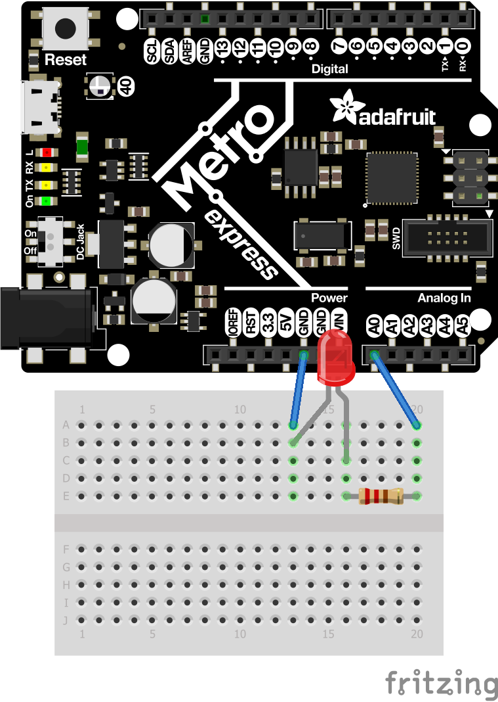

# CircuitPython
My CircuitPython_Assinments

## led_Assignemnt(Hello CircuitPython)

### Description
Make an LED fade in and out using Mu and a Metro Board using Circuit .

### Lesson(s) Learned
I learned how to use, setup Libraries, and the code used with LEDs. This was an intoduction to CircuitPython so this assignment helped me learn how the commands in Circuit Python. Circuitpython is very different from Arduino so it was a big change.

## Servo_Capacitive_Touch_Assignment 

### Description
Depending on which wire is touched will rotate an servo a certain direction.

### Lesson(s) Learned
I learned how to use a PWM pin which was different from the setup of digital and analog pins. Also I have never done anything like capacitive touch before which meant it required a lot of research. 

## LCD_Assignment 

### Description
Will display a counter that goes either up 1 or down when a button is clicked depending on the state of switch.

### Lesson(s) Learned
This was the first time coding a button and a switch in CircuitPython meaning it required a bit of research. 
When making the assignment the button was a bit fidgety so it helped me improve my timing skills in CircuitPyton.

## PhotoInterruptor

### Description
Will read the amount of interruptions within a 4 second interval and print out how many interruptions there were

### Lesson(s) Learned

## Sensor_Assignment

### Description
Uses a sensor to read distance and changes color of onboard LED accordingly.

### Lesson(s) Learned
This was my first time using a HC-SRO4 in CircuitPython so there was a bit of researching/googling required to figure out how to use it in CircuitPython. Also this was my first use of mapping with CircuitPython.

## RGB

### Description
Making 2 different LEDs change between 3 specific RGB values and then start at red and fade through the rainbow and end back on red.

###Lesson(s) Learned

## Hello VS Code

### Description
Intro to using VS Code and how to setup VS code with python.

###Lesson(s) Learned

## Fancy LED

### Description
Using six LEDS you have to make half of them do a certain action in this case alternate, sprkle, blink, and chase by making libraries.

### Lesson(s) Learned

